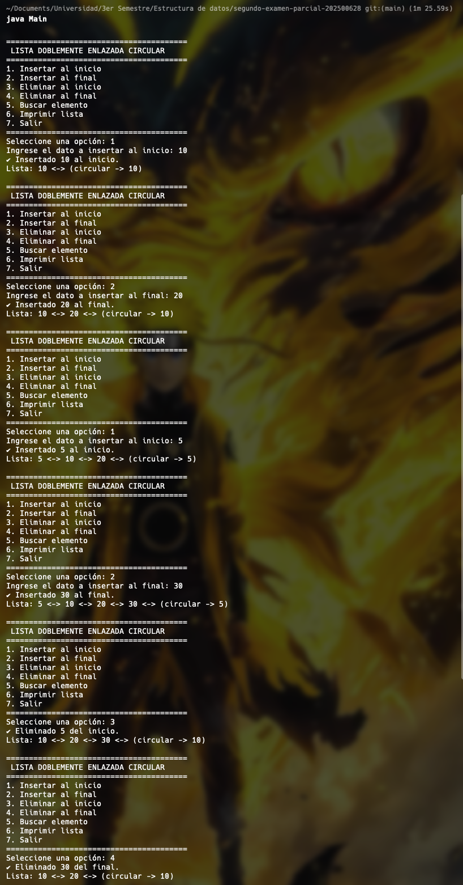
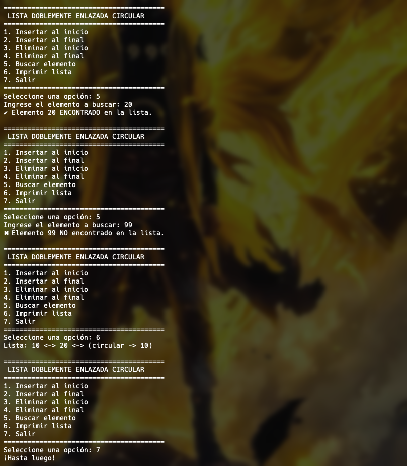

## Examen Parcial - Estructuras de Datos

## Información del Estudiante

| Campo | Detalle |
| --- | --- |
| **Nombre** | \[Tu nombre completo\] |
| **Carné** | \[Tu número de carné\] |
| **Curso** | Estructuras de Datos |
| **Catedrático** | Ing. Brandon Chitay |

## Descripción del Proyecto

Una **Lista Doblemente Enlazada Circular** es una estructura de datos en la que cada nodo contiene tres campos: un dato entero, una referencia al nodo **anterior** y una referencia al nodo **siguiente**. A diferencia de una lista convencional, el último nodo apunta de regreso al primero (vía `siguiente`) y el primer nodo apunta al último (vía `anterior`), formando un ciclo cerrado.

### Operaciones implementadas

| # | Operación | Puntos |
| --- | --- | --- |
| 6.1 | Insertar al inicio | 15 |
| 6.2 | Insertar al final | 15 |
| 6.3 | Eliminar al inicio | 15 |
| 6.4 | Eliminar al final | 15 |
| 6.5 | Buscar un elemento | 10 |
| 6.6 | Imprimir / Recorrer la lista | 10 |
| 6.7 | Menú interactivo | 10 |

## Video Explicativo

\> 🎥 [https://drive.google.com/file/d/1iIn-HkHA7J7l__IsgEJuPh6Qul018CD4/view?usp=sharing](https://drive.google.com/file/d/1iIn-HkHA7J7l__IsgEJuPh6Qul018CD4/view?usp=sharing)

## Instrucciones de Compilación y Ejecución

### Requisitos

*   Java JDK 8 o superior instalado.
*   Terminal / símbolo del sistema abierto en la carpeta del proyecto.

### Compilar

```plaintext
javac Nodo.java ListaDobleCircular.java Main.java
```

### Ejecutar

```plaintext
java Main
```

## Resultados

A continuación se muestra la ejecución del programa con cada operación:

```plaintext
========================================
 LISTA DOBLEMENTE ENLAZADA CIRCULAR
========================================
1. Insertar al inicio
2. Insertar al final
3. Eliminar al inicio
4. Eliminar al final
5. Buscar elemento
6. Imprimir lista
7. Salir
========================================
Seleccione una opción: 1
Ingrese el dato a insertar al inicio: 10
✔ Insertado 10 al inicio.
Lista: 10 &lt;-&gt; (circular -&gt; 10)

Seleccione una opción: 2
Ingrese el dato a insertar al final: 20
✔ Insertado 20 al final.
Lista: 10 &lt;-&gt; 20 &lt;-&gt; (circular -&gt; 10)

Seleccione una opción: 1
Ingrese el dato a insertar al inicio: 5
✔ Insertado 5 al inicio.
Lista: 5 &lt;-&gt; 10 &lt;-&gt; 20 &lt;-&gt; (circular -&gt; 5)

Seleccione una opción: 2
Ingrese el dato a insertar al final: 30
✔ Insertado 30 al final.
Lista: 5 &lt;-&gt; 10 &lt;-&gt; 20 &lt;-&gt; 30 &lt;-&gt; (circular -&gt; 5)

Seleccione una opción: 3
✔ Eliminado 5 del inicio.
Lista: 10 &lt;-&gt; 20 &lt;-&gt; 30 &lt;-&gt; (circular -&gt; 10)

Seleccione una opción: 4
✔ Eliminado 30 del final.
Lista: 10 &lt;-&gt; 20 &lt;-&gt; (circular -&gt; 10)

Seleccione una opción: 5
Ingrese el elemento a buscar: 20
✔ Elemento 20 ENCONTRADO en la lista.

Seleccione una opción: 5
Ingrese el elemento a buscar: 99
✖ Elemento 99 NO encontrado en la lista.

Seleccione una opción: 6
Lista: 10 &lt;-&gt; 20 &lt;-&gt; (circular -&gt; 10)

Seleccione una opción: 7
¡Hasta luego!
```

\> .  


## Estructura del Proyecto

| Archivo | Descripción |
| --- | --- |
| `Nodo.java` | Define la clase `Nodo` con los campos `dato`, `anterior` y `siguiente` |
| `ListaDobleCircular.java` | Implementa todas las operaciones de la lista (insertar, eliminar, buscar, imprimir) |
| `Main.java` | Contiene el menú interactivo y el punto de entrada del programa |
| `README.md` | Documentación del proyecto |